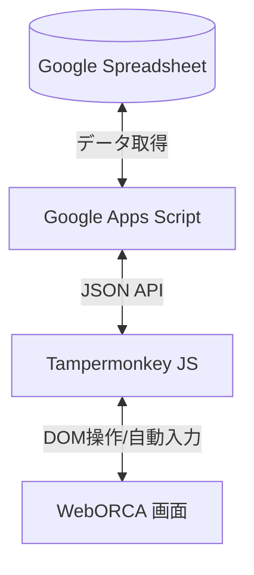
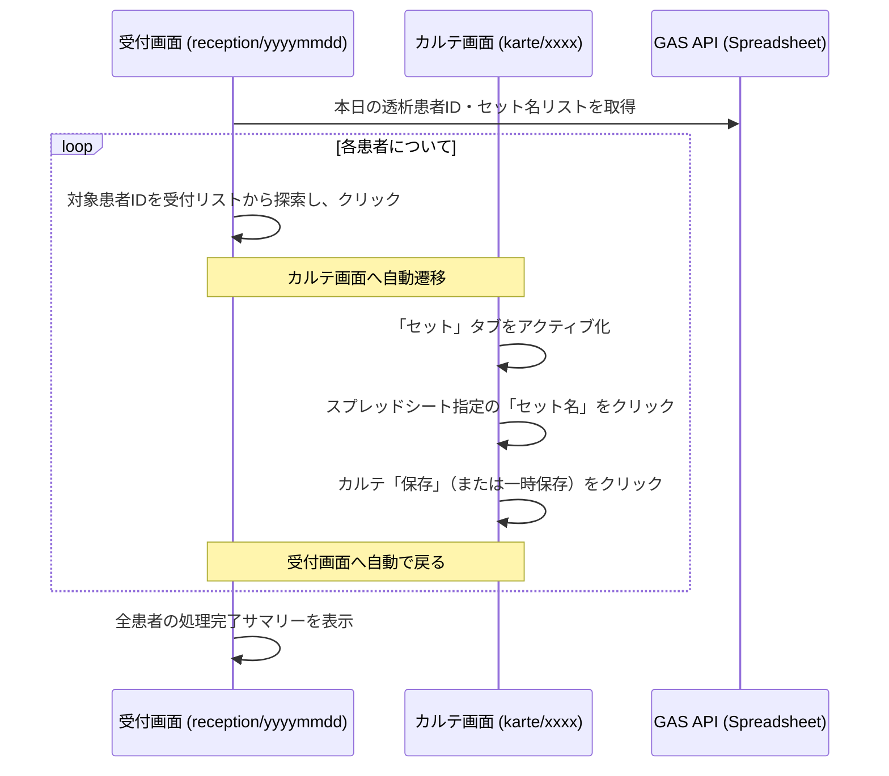

# WebORCA 自動受付システム 要件定義書

スプレッドシートに登録された患者情報（曜日・クール・保険区分）と、医師の担当シフト情報を元に、WebORCA上で対象の患者を一括で自動受付するシステム。

---

## 1. システム概要・構成

本システムは、Googleスプレッドシートで管理されている患者の来院スケジュール（曜日・クール）および医師シフトデータを元に、WebORCA（日医標準レセプトソフト Web版）の受付画面で自動的に受付登録を行うツールです。

### 構成要素

1. **データソース**: Google Spreadsheet
   - シート1 (`patient_list`): 患者ID、保険区分、曜日、クール（午前午後）
   - シート2 (`HD_Dr`): 曜日、クール、担当医師
2. **中間API**: Google Apps Script (GAS)
   - スプレッドシートから指定した条件（曜日・クール）に合致する「患者リスト」および「担当医師」を抽出し、JSON形式でTampermonkeyへ提供するAPI。
3. **自動化実行部**: Tampermonkey スクリプト (JavaScript)
   - WebORCAの受付画面に「自動受付実行」ボタン等のUIを追加。
   - APIから取得した患者データを1件ずつWebORCAのフォームに自動入力し、受付登録を実行する。

---

## 2. 業務フロー（自動受付のステップ）

1. **受付準備**
   - WebORCAの「受付」画面（または患者登録画面）を開く。
   - 画面上に追加された「自動受付実行」UIにて、受付を行いたい「対象の曜日」および「クール（午前/午後）」を選択し、実行ボタンを押下する。
2. **データ取得**
   - TampermonkeyスクリプトがGAS APIを呼び出し、選択された曜日・クールに該当する「患者ID・保険区分」のリストと、そのシフトの「担当医師」の情報を取得する。
3. **自動受付ループ（患者ごと）**
   - 取得した患者リストから1人ずつ以下の操作を自動で行う：
     1. **患者ID入力・検索**: 患者ID入力欄に対象IDを流し込み、Enterキーを押下して患者情報を呼び出す。
     2. **保険区分選択**: 
        - スプレッドシートから指定された「保険区分」に合致する保険（または優先保険）を画面上の選択肢から選択する。
     3. **診療科・医師選択**:
        - 診療科（例: 人工透析、内科など）を選択する。
        - 担当医師のドロップダウンから、GAS APIから取得した「担当医師」を選択する。
     4. **登録実行**:
        - 「登録（または受付）」ボタンをクリックする。
        - 「登録しますか？」等の確認ダイアログが表示された場合は、自動で「OK」を選択する。
     5. **エラー・警告ハンドリング**:
        - 「保険期限が切れています」「重複受付です」などの警告ダイアログやエラーが発生した場合は、処理を一時停止してエラーログを画面上に表示し、手動確認を促すか、スキップして次の患者へ進む。
4. **完了報告**
   - すべての患者の受付処理が完了した後、成功件数とエラー件数（エラーがあった患者IDと理由）を画面上にリスト表示する。

---

## 3. スプレッドシート データ構造（想定）

### シート1: `patient_list` (患者リスト)
※患者ごとの基本スケジュールと保険区分が格納されている想定。

| 列 (想定) | 項目名 | 説明 | 例 |
| :--- | :--- | :--- | :--- |
| A | 患者ID | WebORCAの患者番号 | `0001234` |
| B | 氏名 | 患者氏名（任意） | `医療 太郎` |
| C | 保険区分 | 受付時に選択すべき保険の識別子 | `国保` または `1` |
| D | 曜日 | 受診曜日 | `月` (または `月曜日`) |
| E | クール | 受診時間帯 | `午前` (または `午後`) |

### シート2: `HD_Dr` (医師シフト)
※曜日およびクールごとの担当医師が格納されている想定。

| 列 (想定) | 項目名 | 説明 | 例 |
| :--- | :--- | :--- | :--- |
| A | 曜日 | 対象曜日 | `月` |
| B | クール | 受診時間帯 | `午前` |
| C | 担当医師 | WebORCA上で選択する医師名、または医師コード | `山田 太郎` または `0001` |

---

## 4. UI・デザイン要件（Tampermonkey 拡張UI）

医療現場での使いやすさと信頼感を重視した、プレミアムなコントロールパネルをWebORCAの受付画面内に埋め込みます。

- **配色**: 清潔感のある医療用テーマ（ミントグリーンまたは信頼感のあるブルー、ダークモード対応）。
- **コントロールパネル**: WebORCAの受付画面の邪魔にならない位置（サイドパネル、またはヘッダー付近）にフローティング表示。
- **機能**:
  - 曜日・クール選択ドロップダウン（当日の曜日・時間帯から自動デフォルト選択）
  - 「自動受付を開始」ボタン（ローディングアニメーション付き）
  - 進捗インジケータ（「現在 5/20 件目を処理中...」）
  - 結果ログエリア（成功した患者、警告・エラーが発生した患者を色分けして表示）

---

## 5. 技術スタック

- **フロントエンド**: Tampermonkey (JavaScript)
- **バックエンド**: Google Apps Script (JSON APIとして公開)
- **開発ツール**: Windows PowerShell, Git

---

## 6. ユーザーへの確認事項（Open Questions）

要件を厳密に定義し、実装に移るために、以下の点についてご確認をお願いいたします。

> [!IMPORTANT]
> 1. **スプレッドシートの正確な列レイアウトについて**
>    - シート1 (`patient_list`) とシート2 (`HD_Dr`) の各列の並び順（何列目がどのデータか）を教えていただけますでしょうか。
> 
> 2. **曜日・クールの判定について**
>    - 自動受付を実行する際、**「当日の曜日・時間帯（午前/午後）」を自動で判定**して該当する患者を自動受付する形でよろしいでしょうか。それとも、画面上で手動で曜日・クールを選んで実行できるようにしますか。
> 
> 3. **「保険区分」とWebORCAでの保険選択について**
>    - WebORCAの受付画面では、患者の持っている保険が複数ある場合に選択する画面（あるいは番号指定など）が出ます。スプレッドシートの「保険区分」は、WebORCA上でどのように選択に結びつきますか（例：保険の「保険種別コード」と一致させる、あるいは常に一番上の保険を選択するなど）。
> 
> 4. **担当医師および診療科の指定について**
>    - シート2 (`HD_Dr`) にある「担当医師」は、WebORCAで選択する際の「医師名」と完全一致していますか、それとも「医師コード」ですか。
>    - また、受付時の「診療科」（内科、人工透析科など）はどのように指定しますか（常に固定、あるいは患者ごとに異なるなど）。
> 
> 5. **例外発生時の処理について**
>    - WebORCAで患者IDを入力した際、「保険の有効期限切れ」「他科での同日重複受付」などの警告やエラーダイアログが出ることがあります。これらのエラーが出た場合の挙動はどうしますか。
>      - 案A: エラーダイアログが出た時点で処理を一時停止し、ユーザーが手動で対処して「再開」ボタンを押す。
>      - 案B: その患者の処理をスキップし、ログにエラー理由を記録して、自動で次の患者の処理に進む。

---

## 7. M3デジカル受付画面起点・自動セット入力要件 (追加仕様)

WebORCAでの受付が完了した後、デジカル側の同期データを元に、デジカルの「受付一覧画面」から各患者のカルテへ順次遷移して「セット入力」を行うバッチ処理フローの要件です。

### 7.1. 動作フロー

1. **受付画面での準備と起動 (`https://digikar.jp/reception/yyyymmdd`)**
   - デジカルの受付画面のURLは `https://digikar.jp/reception/yyyymmdd` の形式。
   - 画面上に「デジカル一括セット入力」のコントロールパネルをフローティング表示する。
   - 起動時、GAS APIを呼び出して本日（または指定曜日・クール）の「患者IDリスト」および「デジカルセット名」を取得する。
2. **患者カルテへの遷移**
   - 取得した患者リストの中から、未処理の患者IDを受付画面の受付一覧テーブルから検索する。
   - 患者IDに紐づくカルテへのリンク（または行要素）を検知し、自動でクリックしてカルテ画面へ遷移する。
3. **セット入力と保存（カルテ画面）**
   - カルテ画面へ到達後、右パネル of 「セット」タブをクリックしてアクティブにする。
   - スプレッドシートから取得したその患者用の「セット名」に該当する要素を画面上から探索し、クリックしてカルテへ反映する。
   - カルテの「保存（または一時保存）」ボタンをクリックして変更を反映する。
4. **受付画面への復帰と繰り返し**
   - 保存が成功した後、自動的にブラウザの「戻る」操作、あるいは受付画面のURLへ直接遷移して元の受付画面へ戻る。
   - 受付画面へ復帰後、次の未処理患者IDに対して同様の処理を繰り返し実行する（自動ループ）。
   - すべての患者の処理が完了した場合、またはエラーが発生して停止した場合は、コントロールパネルに進捗結果（成功・失敗・スキップ）をレポート表示する。

### 7.2. 臨床現場におけるUXと安全対策
- **対象患者の識別**: IDが一致しない患者には絶対にセットを流し込まないよう、カルテ画面側の患者ID（`.css-ustlin`内のIDなど）とAPIデータのIDが完全一致することを確認するチェックを挟む。
- **入力セットの有無**: スプレッドシートで指定されたセット名がデジカルの画面上に存在しない場合、または見つからない場合は、処理を中断してアラートを出し、手動確認を促す（あるいは該当患者をスキップしてログに記録する）。
- **一時停止機能**: 実行中に問題が発生した場合に即座に処理を止められるよう、受付画面およびカルテ画面の双方に目立つ「自動処理を停止」ボタンを常駐させる。
- **保存ステータス**: デジカルでの保存処理は、クリニックの運用に合わせて「一時保存」で留めるか、完全に「保存（確定）」まで行うかをスクリプトの設定で切り替えられるようにする。
